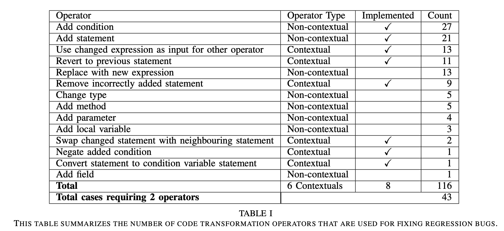

# JRelifix Implementation Planning
## Current
* Repair Framework with supports of:
	* Fault Localization
	* Java Parser
	* Diff Collector (Git)
	* Seeds Collector (with change actions)
	* Java In-Memory Compiler
	* Test Case Invoker
	
## Implementing
Reference tool models:
* [GitHub - qhanam/Java-RSRepair: A Java version of the automatic program repair described by RSRepair and GenProg.](https://github.com/qhanam/Java-RSRepair)
* [GitHub - kusumotolab/kGenProg: A High-performance, High-extensibility and High-portability APR System](https://github.com/kusumotolab/kGenProg)
* [GitHub - xgdsmileboy/SimFix: Automatically fix programs by leveraging existing patches from other projects and similar code snippets from the faulty project.](https://github.com/xgdsmileboy/SimFix)

### Operators
* Relifix implemented 8 over 14 proposed operators from CoreBench

* Implement 8 operators of Relifix to create a baseline tool for Java
* More specific operators (3-5) for Java can be proposed (from InduceBenchmark)

### Patch Generation & Validation Approach
* Follow the proposed algorithm of Relifix
## Packaging (Useable for end users)
* Maven/Gradle Plugin
* Eclipse/IntelliJ Plugin
* CI/CD Tool
* Standalone tool

## Evaluation
Compare performance with state-of-the-arts tools: SimFix, PraPR, CapGen, jGenProg, JAID 
* Evaluate on Java bugs of BugSwarm (provided [here](https://github.com/BugSwarm/bugswarm))
* Evaluate on 91 bugs of Defects4J (provided [here](https://github.com/justinwm/InduceBenchmark/blob/master/Defects4J.csv)). These bugs are provided with bug-inducing commits but we also need filter regression bugs.
* Evaluate on 362 bugs of InduceBenchmark (provided [here](https://github.com/justinwm/InduceBenchmark)). These projects needs complex configuration to run.
